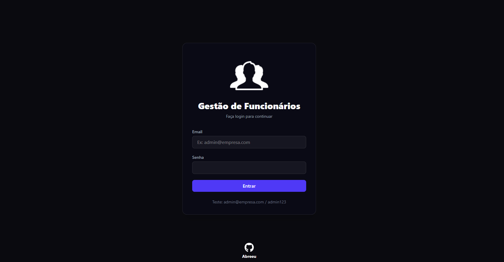
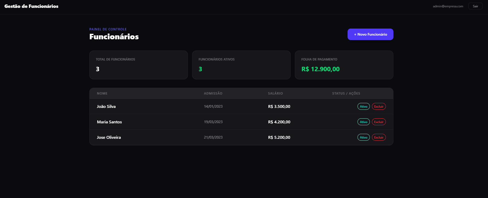

# 🏢 Gestão de Funcionários


## Descrição 

 Aplicação Full Stack de **Gestão de Funcionários**, desenvolvida com Java Spring Boot no backend e React.js no frontend. Permite autenticação de usuários, listagem e cadastro de funcionários, com todo o ambiente orquestrado via Docker Compose.

---
## Demonstração da Interface de Login


## Demonstração da Interface de Dashboard


## Tecnologias Utilizadas 

### Backend
1. Java 
2. Spring Boot 
3. Spring Data JPA 
4. FlywayDB *(migrations automáticas)*
5. PostgreSQL 

### Frontend
1. React.js 
2. JavaScript 

### Infraestrutura e Ambiente
1. Docker 

### Ambiente de Desenvolvimento
1. Visual Studio Code 
2. IntelliJ 

### Consultas
1. [Link Documentação Java](https://docs.oracle.com/en/java/javase/index.html) 
2. [Link Documentação React](https://pt-br.react.dev/learn) 
---

## Pré-requisitos 
 Para rodar este projeto, você precisa ter instalado **apenas**:

- [Docker](https://www.docker.com/get-started) 
- [Docker Compose](https://docs.docker.com/compose/install/)

---

## Como Rodar 

**1. Clone o Repositório**
```bash
git clone ENDEREÇO REPOSITÓRIO
```

**2. Acesse a pasta do projeto**
```bash
cd PASTA RAIZ
```

**3. Suba toda a aplicação com um único comando**
```bash
docker-compose up --build
```

> Aguarde o build completo. O Docker irá subir automaticamente o **Banco de Dados**, o **Backend** e o **Frontend**.

**4. Acesse no navegador**

| Serviço  | URL                   |
|----------|-----------------------|
| Frontend | http://localhost:3000 ou npm run dev do REACT |
| Backend  | http://localhost:8080 ou ./mvnw spring-boot:run no INTELLIJ |

---

## Credenciais de Acesso 
 As credenciais abaixo são inseridas automaticamente via **Flyway (Migration V2 - Seed)** na primeira execução:

(OBS: SE HOUVER CONGELAMENTO APOS O LOGIN, APERTE F5)

| Campo | Valor               |
|-------|---------------------|
| E-mail | `admin@empresa.com` |
| Senha  | `admin123`          |

> Use essas credenciais na **Tela de Login** para acessar o Dashboard de Funcionários.

---

## Estrutura do Projeto 

```
📦 projeto-raiz/
├── 📁 backend/
│   ├── src/
│   │   ├── main/java/com.desafio.gestao_funcionarios/
│   │   │   ├── controller/
│   │   │   ├── dto/
│   │   │   ├── model/
│   │   │   ├── repository/
│   │   │   ├── security/
│   │   │   ├── service/
│   │   │   ├── util/
│   │   │   └── GestaoFuncionariosApplication.java
│   │   └── resources/
│   │       └── db/migration/
│   │           ├── V1__create_tables.sql
│   │           └── V2__seed_data.sql
│   └── Dockerfile
├── 📁 frontend/
│   ├── src/
│   │   ├── assets/
│   │   ├── components/
│   │   ├── pages/
│   │   ├── services/
│   │   ├── App.jsx
│   │   ├── index.css
│   │   └── main.jsx
│   ├── public/
│   ├── index.html
│   ├── vite.config.js
│   ├── package.json
│   └── Dockerfile
└── docker-compose.yml
```

---

## Funcionalidades 

- ✅ Autenticação com e-mail e senha (senha criptografada com BCrypt)
- ✅ Listagem de funcionários
- ✅ Cadastro de novos funcionários
- ✅ Dados gerenciados: Nome, Data de Admissão, Salário e Status (Ativo/Inativo)
- ✅ Migrations automáticas com FlywayDB
- ✅ Ambiente 100% containerizado com Docker Compose

---

## Autor

[Abreeu](https://www.linkedin.com/in/abreeu/) 
